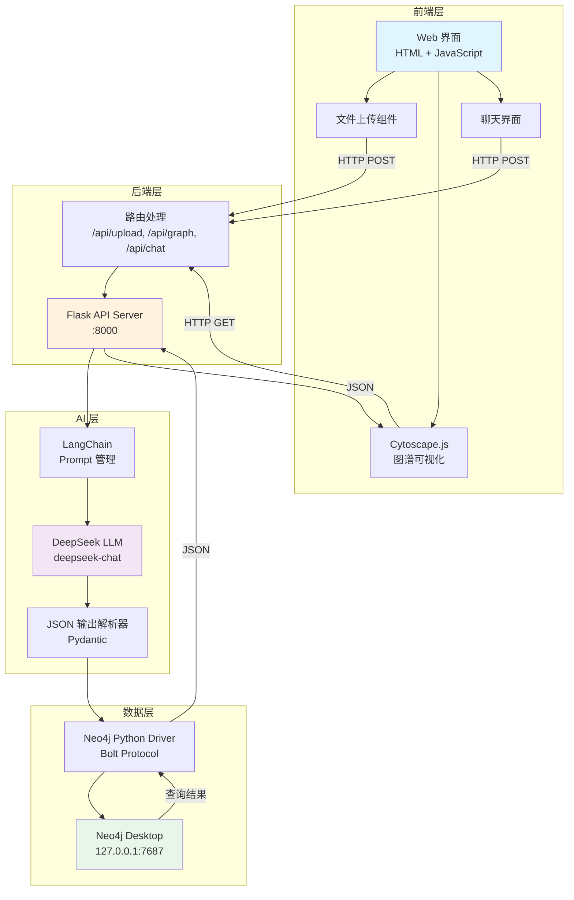
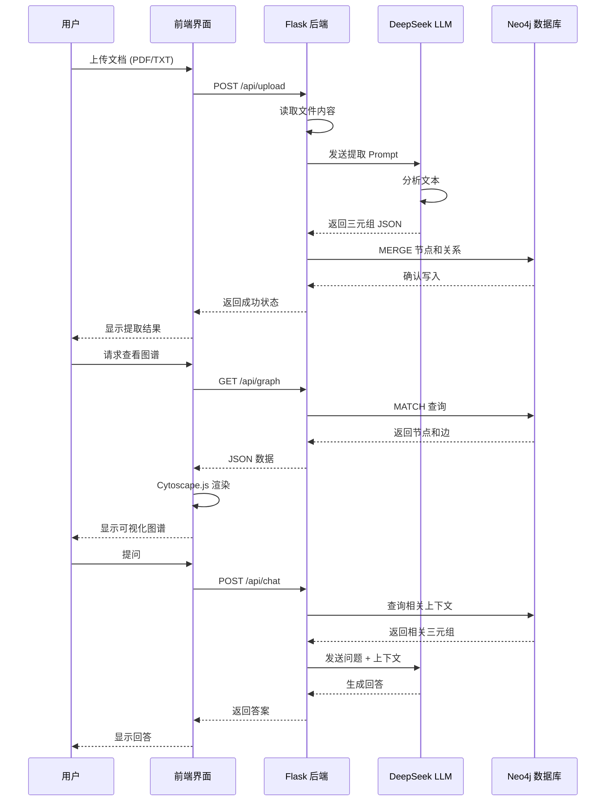

# 🎨 LLM + Neo4j 知识图谱项目架构

## 系统架构图



## 数据流程



## 核心组件说明

### 1. 前端层 (Frontend)

| 组件 | 技术栈 | 功能 |
|------|--------|------|
| **Web 界面** | HTML5 + CSS3 + JavaScript | 用户交互主界面 |
| **图谱可视化** | Cytoscape.js | 交互式知识图谱展示 |
| **文件上传** | FormData API | 支持拖拽上传 |
| **聊天界面** | WebSocket (可选) | 实时问答交互 |

### 2. 后端层 (Backend)

| 组件 | 技术栈 | 功能 |
|------|--------|------|
| **API 服务器** | Flask 3.0 | RESTful API |
| **路由处理** | Flask Blueprint | 模块化路由 |
| **CORS 支持** | Flask-CORS | 跨域请求 |
| **环境配置** | python-dotenv | 配置管理 |

### 3. AI 层 (AI Processing)

| 组件 | 技术栈 | 功能 |
|------|--------|------|
| **Prompt 管理** | LangChain | 提示词模板 |
| **LLM 调用** | langchain-openai | DeepSeek API 集成 |
| **输出解析** | Pydantic + JsonOutputParser | 结构化输出 |
| **Token 管理** | tiktoken | Token 计数 |

### 4. 数据层 (Data Storage)

| 组件 | 技术栈 | 功能 |
|------|--------|------|
| **图数据库** | Neo4j Desktop 5.x | 知识图谱存储 |
| **驱动程序** | neo4j-python-driver 5.16 | 数据库连接 |
| **查询语言** | Cypher | 图查询 |

## 数据模型

### Neo4j 图模型

```cypher
# 节点类型
(:Entity {
  name: String,           # 实体名称（唯一）
  created_at: DateTime    # 创建时间
})

# 关系类型
-[:REL {
  predicate: String,      # 关系名称
  confidence: Float,      # 置信度 (0-1)
  source_doc: String,     # 来源文档
  span: String,           # 原文片段
  updated_at: DateTime    # 更新时间
}]->
```

### API 数据格式

#### 上传响应
```json
{
  "status": "success",
  "triples_count": 15,
  "filename": "physics.txt"
}
```

#### 图谱数据
```json
{
  "nodes": [
    {
      "data": {
        "id": "量子力学",
        "label": "量子力学"
      }
    }
  ],
  "edges": [
    {
      "data": {
        "id": "edge_1",
        "source": "量子力学",
        "target": "薛定谔方程",
        "label": "包含",
        "confidence": 0.95
      }
    }
  ]
}
```

## 文件结构

```
llmgnn/
├── backend/
│   ├── app.py                    # Flask 主应用
│   ├── test_neo4j.py            # 连接测试
│   ├── extract_demo.py          # 提取示例
│   ├── graph_operations.py      # 图操作库
│   ├── requirements.txt         # 依赖列表
│   ├── .env                     # 环境变量
│   └── templates/
│       └── index.html           # 前端页面
├── venv/                        # 虚拟环境
├── README.md                    # 项目文档
└── docs/
    └── architecture.md          # 架构文档（本文件）
```

## 部署架构

### 开发环境
```
本地开发机
├── Neo4j Desktop (127.0.0.1:7687)
├── Flask Dev Server (localhost:8000)
└── 浏览器 (localhost:8000)
```

### 生产环境（建议）
```
云服务器
├── Neo4j Server (Docker)
├── Flask + Gunicorn
├── Nginx (反向代理)
└── SSL 证书
```

## 性能指标

| 指标 | 目标值 | 说明 |
|------|--------|------|
| **文件上传** | < 2s | 小于 1MB 文本 |
| **三元组提取** | < 5s | 1000 字文本 |
| **图谱查询** | < 500ms | 100 个节点 |
| **可视化渲染** | < 1s | 500 个节点 |
| **并发用户** | 10+ | 开发环境 |

## 扩展方向

### 短期优化
1. 添加进度条和加载动画
2. 实现实体搜索和过滤
3. 支持更多文件格式（PDF、DOCX）
4. 优化三元组提取 Prompt

### 中期增强
1. 实体消歧和链接
2. 关系类型分类
3. 社区检测和聚类
4. 图谱导出功能

### 长期规划
1. 多模态支持（图片、视频）
2. 分布式部署
3. 实时协作编辑
4. 知识推理引擎

## 安全考虑

| 风险 | 防护措施 |
|------|----------|
| **SQL 注入** | 使用参数化查询 |
| **XSS 攻击** | 输入验证和转义 |
| **文件上传** | 类型检查、大小限制 |
| **API 滥用** | 速率限制、认证 |
| **敏感数据** | 环境变量、加密存储 |

## 监控和日志

### 日志级别
- **DEBUG**: 详细的调试信息
- **INFO**: 正常操作日志
- **WARNING**: 警告信息
- **ERROR**: 错误信息

### 监控指标
- API 响应时间
- LLM 调用次数和成本
- Neo4j 查询性能
- 错误率和异常

## 技术选型理由

| 技术 | 选择理由 |
|------|----------|
| **Neo4j** | 原生图数据库，Cypher 查询强大 |
| **Flask** | 轻量级，易于快速开发 |
| **LangChain** | 简化 LLM 集成，丰富的工具链 |
| **DeepSeek** | 性价比高，中文支持好 |
| **Cytoscape.js** | 功能强大，文档完善 |

## 参考资源

- [Neo4j 图数据建模](https://neo4j.com/developer/guide-data-modeling/)
- [Flask 最佳实践](https://flask.palletsprojects.com/en/3.0.x/patterns/)
- [LangChain 文档](https://python.langchain.com/)
- [Cytoscape.js 教程](https://js.cytoscape.org/#getting-started)
